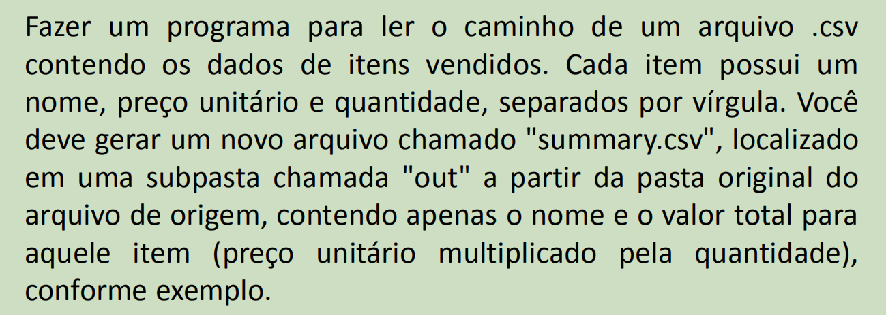
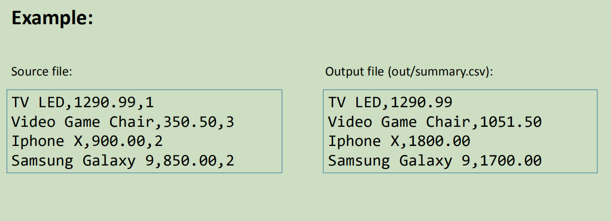

# Módulo 13 - Leituras e escrita de arquivos

É uma atividade do *Módulo 13* do curso de `C# Completo Programação Orientada a Objetos (POO)` Do professor `Nélio Alves`. 
Curso existente na plataforma [Udemy](https://www.udemy.com/course/programacao-orientada-a-objetos-csharp/).

* Implementar um sistema que leia um arquivo com (nome, preço, quantidade) e crie um diretório e outro arquivo com (nome, valor total).

## Exercício

## Dados do Autor

Autor: `Matheus Glauber Rodrigues Jordão` [Linkedin](https://www.linkedin.com/in/matheusglauber/).
